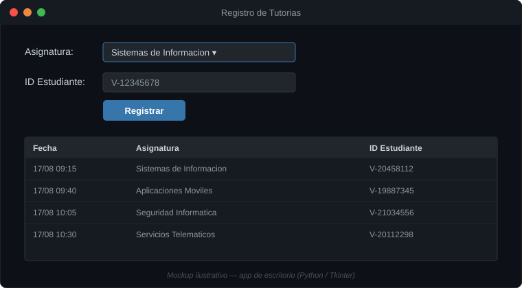

# Sistema de Tutorías

Aplicación de escritorio para registrar sesiones de tutoría académica: asignatura, ID de estudiante y fecha, con listado en tabla.

<p align="center">

</p>

> App de escritorio (Python / Tkinter) — no aplica demo web. Imagen de arriba es un mockup ilustrativo del flujo real, no una captura en vivo.

## Stack


## Cómo correrlo

```bash
python SI.py
```
